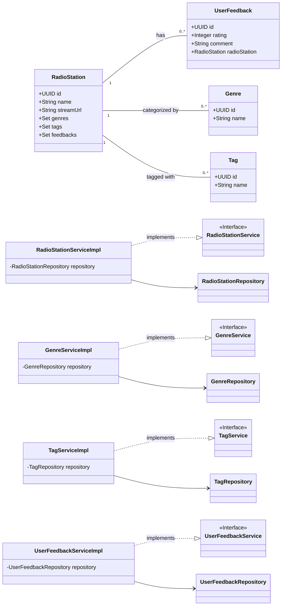

```mermaid
classDiagram
    direction LR

    class RadioStation {
        +UUID id
        +String name
        +String streamUrl
        +Set<Genre> genres
        +Set<Tag> tags
        +Set<UserFeedback> feedbacks
    }

    class Genre {
        +UUID id
        +String name
    }

    class Tag {
        +UUID id
        +String name
    }

    class UserFeedback {
        +UUID id
        +Integer rating
        +String comment
        +RadioStation radioStation
    }

    class RadioStationService {
        <<Interface>>
    }
    class GenreService {
        <<Interface>>
    }
    class TagService {
        <<Interface>>
    }
    class UserFeedbackService {
        <<Interface>>
    }

    class RadioStationServiceImpl {
        -RadioStationRepository repository
    }
    class GenreServiceImpl {
        -GenreRepository repository
    }
    class TagServiceImpl {
        -TagRepository repository
    }
    class UserFeedbackServiceImpl {
        -UserFeedbackRepository repository
    }

    RadioStation "1" -- "0..*" UserFeedback : has
    RadioStation "1" -- "0..*" Genre : categorized by
    RadioStation "1" -- "0..*" Tag : tagged with

    RadioStationServiceImpl ..|> RadioStationService : implements
    GenreServiceImpl ..|> GenreService : implements
    TagServiceImpl ..|> TagService : implements
    UserFeedbackServiceImpl ..|> UserFeedbackService : implements

    RadioStationServiceImpl --> RadioStationRepository
    GenreServiceImpl --> GenreRepository
    TagServiceImpl --> TagRepository
    UserFeedbackServiceImpl --> UserFeedbackRepository

```
